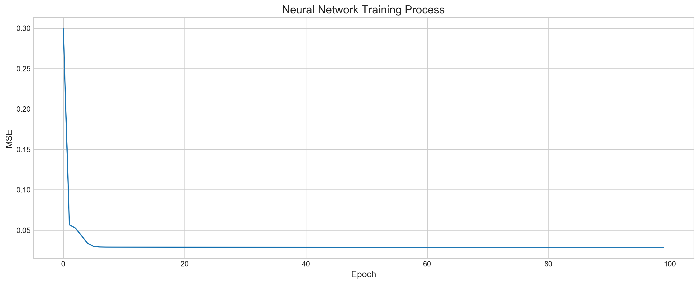

# Neural Network From Scratch

This notebook can help you to understand how to build neural network from scratch.

Our neural network would have three layers:
1. Input layer
2. Hidden layer with 3 neurons
3. output layer

All the layers and their parameters are hardcoded, which can be viewed as limitation, but for illustration purposes it's the ideal set up. The limitations for the network are following: 
1. We have predetermined input size. In our case it's two features, so input size is 2
2. We have one hidden layer has 3 neurons, we cannot add more layers to the network
3. We have predetermined output size, because we a working on regression problem

It is possible to change every hardcoded parameters manually, so I encourage you to play with the code, change parts, optimize it.

## Importing Libraries


```python
import numpy as np
import pandas as pd
import matplotlib.pyplot as plt
from tensorflow import keras
from sklearn.preprocessing import MinMaxScaler
from sklearn.metrics import mean_squared_error, r2_score
from sklearn.model_selection import train_test_split
from sklearn.datasets import california_housing
```

## Data

California housing dataset


```python
housing_data = california_housing.fetch_california_housing()
Features = pd.DataFrame(housing_data.data, columns=housing_data.feature_names)
Target = pd.DataFrame(housing_data.target, columns=['Target'])
df = Features.join(Target)
```

### Scaling


```python
scaler = MinMaxScaler()
df_scaled = scaler.fit_transform(df[['MedInc','AveRooms','Target']])
```

### Train Test Split


```python
X_train, X_test, y_train, y_test = train_test_split(
                            
    df_scaled[:10000, :2], # Features
    df_scaled[:10000, 2:], # Target
    test_size=0.33, 
    random_state=42

)
```

## 1. Simple Neural Network


```python
class SimpleNeuralNetwork:
    
    def __init__(self): 
        
        '''        
        Initial weights and biases assigned random values ranging '0' to '1'. 
        We have a total of 9 weights and 4 biases.
        6 weights are coming in the hidden layer, two for each neuron, hence 3 x 2 = 6.
        The rest of the weights are coming into the output layer.
        Same story for the biases. Each bias is attached to the neuron in the hidden layer
        and output layer.
        '''
        # Weights
        self.w1, \
        self.w2, \
        self.w3, \
        self.w4, \
        self.w5, \
        self.w6, \
        self.w7, \
        self.w8, \
        self.w9 = np.random.rand(9)

        # Biases
        self.b_n1, \
        self.b_n2, \
        self.b_n3, \
        self.b_y_hat = np.random.rand(4) 

    # Activation function for the neurons
    # Each neuron IS an actually activation function itself
    # sigmoid is for forward propagation, sigmoid derivative is for back propagation
    def sigmoid(self, x): return 1 / (1 + np.e**-x)
    def sigmoid_der(self, x): return self.sigmoid(x) * (1 - self.sigmoid(x))

    
    '''
    Feedforward function produces result of the network prediction for each sample.
    First we find neurons' values for hidden layer, then for output layer.
    '''
    def feedforward(self, x):

        # x[0], x[1] - our features
        # n* - neurons in the hidden layer, y_hat - predicted value
        self.n1 =    self.sigmoid(x[0]*self.w1 + x[1]*self.w2 + self.b_n1)
        self.n2 =    self.sigmoid(x[0]*self.w3 + x[1]*self.w4 + self.b_n2)
        self.n3 =    self.sigmoid(x[0]*self.w5 + x[1]*self.w6 + self.b_n3)

        self.y_hat = self.sigmoid(self.n1*self.w7 + self.n2*self.w8 + self.n3*self.w9 + self.b_y_hat)

    
    '''
    Backpropagation updates all the weights and biases of the network.
    By using Gradient Descent technique, each trainable parameter (weight or bias)
    is changing a little bit towards minimum of MSE.
    Unlike forward propagation, we tweak our parameters starting
    from the right end of the network, meaning first we update
    weights and biases for output layer, then for the hidden.
    If we had more than one hidden layer, we would go over them 
    is similar fashion, 
    like this: "output layer" => "hidden layer 2" => "hidden layer 1"
    '''
    def backpropagation(self, x, y):

        # We calculate some values here to use them later
        y_hat_der = (-2 * (y-self.y_hat) * self.sigmoid_der(self.y_hat))
        z_w7_der = self.w7 * self.sigmoid_der(self.n1)
        z_w8_der = self.w8 * self.sigmoid_der(self.n2)
        z_w9_der = self.w9 * self.sigmoid_der(self.n3)

        # Biases
        self.b_n1    -= self.lr * y_hat_der * z_w7_der
        self.b_n2    -= self.lr * y_hat_der * z_w8_der
        self.b_n3    -= self.lr * y_hat_der * z_w9_der
        self.b_y_hat -= self.lr * y_hat_der

        # Weights
        self.w7 -= self.lr * y_hat_der * self.n1
        self.w8 -= self.lr * y_hat_der * self.n2
        self.w9 -= self.lr * y_hat_der * self.n3
        
        self.w1 -= self.lr * y_hat_der * z_w7_der * x[0]
        self.w2 -= self.lr * y_hat_der * z_w7_der * x[1]
        self.w3 -= self.lr * y_hat_der * z_w8_der * x[0]
        self.w4 -= self.lr * y_hat_der * z_w8_der * x[1]
        self.w5 -= self.lr * y_hat_der * z_w9_der * x[0]
        self.w6 -= self.lr * y_hat_der * z_w9_der * x[1]
        
    
    '''
    Training process is the combination of forward and back propagations.
    '''
    def fit(self, X, y, epoch=10, lr=0.01):

        mse_list = []
        self.lr = lr

        # Loop to go over epochs. Each epoch train network on all available data.
        # We also check MSE and store it to visualize training process
        for i in range(epoch):
            mse = mean_squared_error(y, self.predict(X))
            mse_list.append(mse)
            print('Epoch: {} / {}, MSE: {}'.format(i+1, epoch, round(mse, 4)), end='\r')

            # Loop to go over each training example for current epoch
            for j in range(len(X)):
                self.feedforward(X[j])
                self.backpropagation(X[j], y[j][0]) 

        return mse_list

    '''
    This function is very similar to feed forward,
    it's in fact uses 'feedforward' function to make predictions.
    The only difference is that we predict outcome for all samples.
    '''
    def predict(self, X):

        result = []

        for x in X:
            self.feedforward(x)
            result.append(self.y_hat)

        return result
```

## Testing Neural Network


```python
model = SimpleNeuralNetwork()
```


```python
history = model.fit(X_train, y_train, epoch=100, lr=0.05)
```

    Epoch: 100 / 100, MSE: 0.0285


```python
plt.rcParams['figure.dpi'] = 227
plt.rcParams['figure.figsize'] = (16, 6)
plt.style.use('seaborn-whitegrid')
plt.plot(history)
plt.title('Neural Network Training Process', fontSize=15)
plt.xlabel('Epoch', fontSize=12)
plt.ylabel('MSE', fontSize=12)
plt.show()
```





```python
y_pred = model.predict(X_test)
```


```python
mse = mean_squared_error(y_test, y_pred)
mse
```


    0.028357368457188573


## 2. Keras Neural Network


```python
keras.backend.clear_session()

keras_model = keras.Sequential()
keras_model.add(keras.layers.Input((2,)))
keras_model.add(keras.layers.Dense(3, activation='sigmoid', use_bias=True))
keras_model.add(keras.layers.Dense(1, activation='sigmoid', use_bias=True))

keras_model.compile(loss='mse')
```


```python
keras_model.summary()
```

    Model: "sequential"
    _________________________________________________________________
    Layer (type)                 Output Shape              Param #   
    =================================================================
    dense (Dense)                (None, 3)                 9         
    _________________________________________________________________
    dense_1 (Dense)              (None, 1)                 4         
    =================================================================
    Total params: 13
    Trainable params: 13
    Non-trainable params: 0
    _________________________________________________________________


```python
history_keras = keras_model.fit(X_train, y_train, epochs=100, verbose=0)
```


```python
plt.rcParams['figure.dpi'] = 227
plt.rcParams['figure.figsize'] = (16, 6)
plt.style.use('seaborn-whitegrid')
plt.plot(history_keras.history['loss'])
plt.title('Keras Neural Network Training Process', fontSize=15)
plt.xlabel('Epoch', fontSize=12)
plt.ylabel('MSE', fontSize=12)
plt.show()
```


```python
y_pred_keras = keras_model.predict(X_test)
```


```python
mse_keras = mean_squared_error(y_test, keras_model.predict(X_test))
mse_keras
```


    0.028092162461256922


## 3. Comparing Our Neural Network with Keras


```python
print("MSE Simple:", round(mse, 3))
print("MSE Keras: ", round(mse_keras, 3))
```

    MSE Simple: 0.028
    MSE Keras:  0.028


```python
print("R-squared Simple:", round(r2_score(y_test, y_pred), 3))
print("R-squared Keras: ", round(r2_score(y_test, y_pred_keras), 3))
```

    R-squared Simple: 0.497
    R-squared Keras:  0.502


# Conclusion

Simple neural network has the same capabilities as the Keras analog, and was able to produce identical accuracy. That means it's working correctly and is efficient enough.

# Next Steps

There are plenty of things we can do with our neural network, such as:
- Rewrite feedforward and backpropagation to the matrix form
- Make adding more than one layers and as many neurons as we want possible
- Add different activation functions, like Tanh or ReLu
- Add different cost function, like a binary cross-entropy for classification problems
